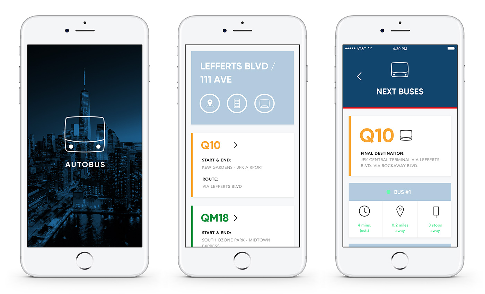
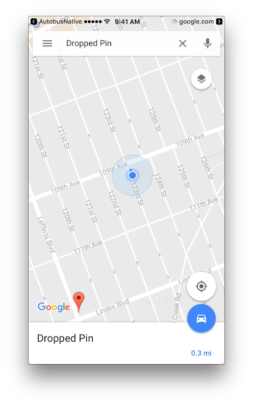
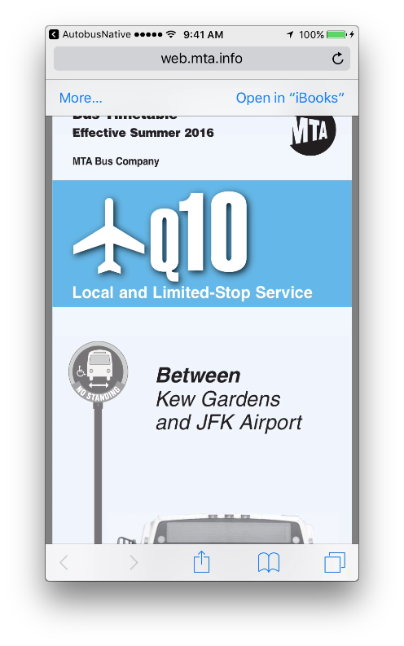

# Autobus

Autobus provides you with live updates of NYC's MTA buses for nearby stops. The app automatically uses your phone's GPS to pull in the nearest bus stops and all incoming routes/buses that service that stop.

## APIs

Autobus makes use of two public APIs provided by the NYC MTA. 

[One Bus Away API](http://bustime.mta.info/wiki/Developers/OneBusAwayRESTfulAPI) - utilized with the mobile device's GPS to pull in a number of nearby bus stops.

[SIRI Standard API](http://bustime.mta.info/wiki/Developers/SIRIIntro) - provides real-time data for stop monitoring (what bus routes are served and real-time updates on approaching buses).

# Locating nearby stops

Autobus uses your current GPS latitude and longitude coordinates to make a call to the **One Bus Away** API. The API responds with a number of stops within a set radius of your current location. The response includes a number of routes that serve that stop. The app provides a link to Google Maps that drops a pin at the stop's location (either through the Google Maps app if the user already has it downloaded, or via a new browser window in Safari).  

# Linking to Route Schedule

For every route, Autobus provides a link to a PDF of the official MTA schedule of that route. This link opens in the user's default browser.