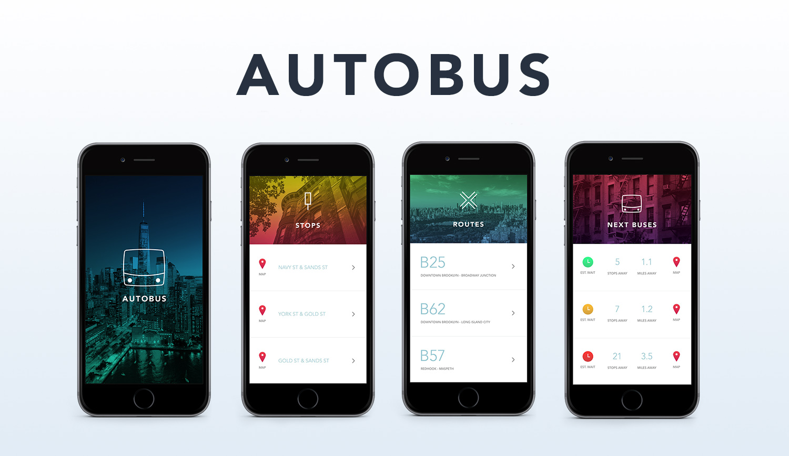

# Autobus

## How Autobus Works
 
Autobus is an iOS app built on [React Native](https://facebook.github.io/react-native/). It automatically finds all nearby [New York City MTA](http://www.mta.info/) bus stops, the routes they serve and track (in-real time) any buses approaching a specific stop. It does this by using your phone’s location services in conjunction with two separate APIs provided by the New York City MTA.

## Finding Nearby Stops
 
Autobus automatically uses your phone’s geolocation (once you grant permission through the prompt when the app launches) to pinpoint your current latitudinal and longitudinal coordinates. The app then bundles those coordinates with a pre-set radius and sends a request to the [One Bus Away API](http://bustime.mta.info/wiki/Developers/OneBusAwayRESTfulAPI). The API responds with a list of nearby stops. Each stop returns with details about that stop, such as: cross streets, coordinates (which the app uses to display the stop on Google maps), a list of bus routes being serviced and a stop code. 
 
## Finding Next Buses
 
The stop code provided by the response data from the One Bus API is then used in a request to the [Siri Standard API](http://bustime.mta.info/wiki/Developers/SIRIIntro) - a separate API provided by the MTA, that tracks current, live bus data. The response from the Siri API provides a list of all approaching buses heading to the stop (as provided via a stop code in the request) as well as details for each of those buses. These bus details include: bus number, current coordinates at the time of the response, distance from the stop and stops away from the provided stop.

## APIs 

[One Bus Away API](http://bustime.mta.info/wiki/Developers/OneBusAwayRESTfulAPI) - utilized with the mobile device's GPS to pull in a number of nearby bus stops.

[SIRI Standard API](http://bustime.mta.info/wiki/Developers/SIRIIntro) - provides real-time data for stop monitoring (what bus routes are served and real-time updates on approaching buses).
